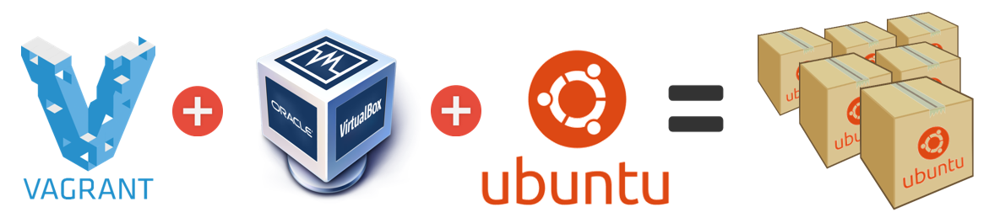
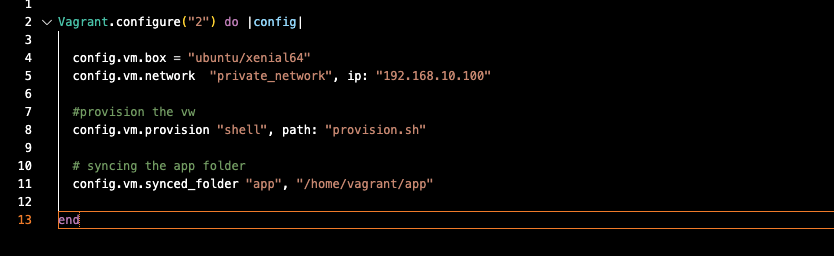
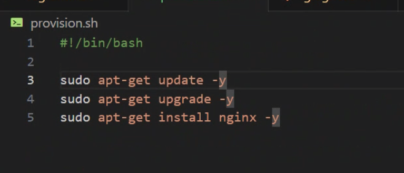
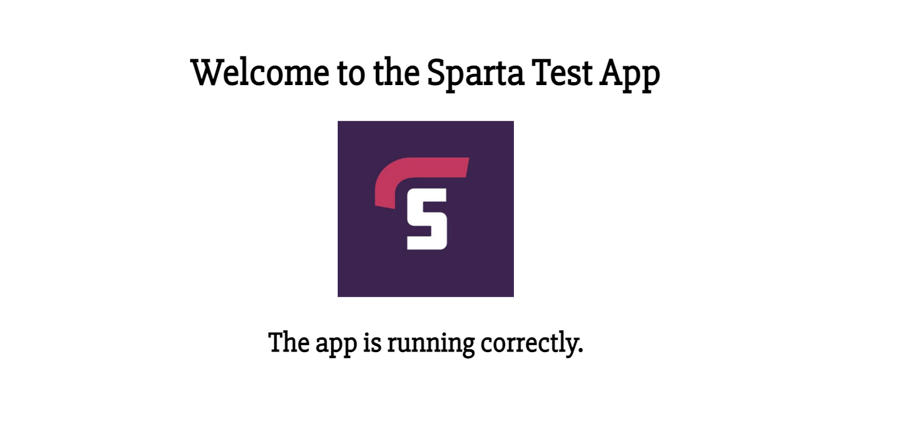
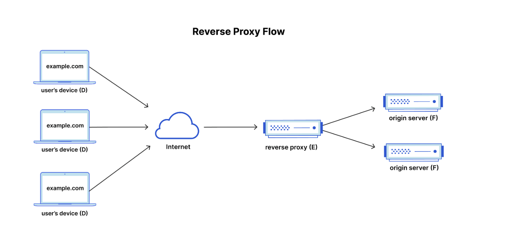
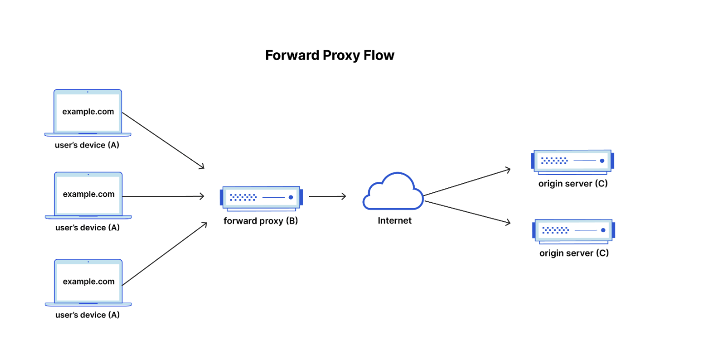
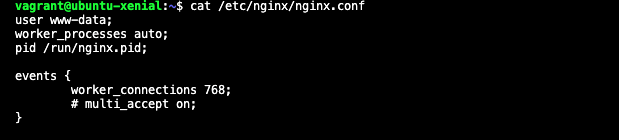

# Syncing vagrant to Virtual Machine and running a app

## Create a Vagrant file

1. Make sure to be in the correct folder in vs code by using `cd` iv put mine in the virtualisation folder.
2. Then we use the command `touch vagrant` to make a vagrant file in the repo.
3. We then change the ‘base’ to look like this.

 `Vagrant.configure("2") do |config|`

  `config.vm.box = "ubuntu/xenial64”`

4. We then use `vagrant up` to access vagrant from vs code

## Create a provision file for script

1. We `touch provision.sh` to create a provision shell file
2. we `nano` into the file 
3. Then add this script to the file in vscode 

`#!/bin/bash`

`sudo apt-get update -y` 
`sudo apt-get upgrade -y`
`sudo apt-get install nginx -y`

4. we then have to change permissions using `chmod`

3. Then we add this line into the vagrant file as the 3rd line 

`config.vm.provision "shell", path: "provision.sh”`

4. The we run `vagrant up` to check the script is running and you should see everything being executed

## syncing the app folder 

1. After adding the app folder to the repo
2. In the vagrant file add `config.vm.synced_folder "app", "/home/vagrant/app”`
3. Ensure its in the correct place by using `pwd` in vscode it should show /home/vagrant from the terminal
4. The do `vagrant up` 
5. Then in bash - `vagrant ssh`then use `ls` to check the app folder has synced over to the virtual machine

## install ruby to run tests and check 

1. `cd` into environment folder and then into spec-tests
2. `sudo gem install bundler` - without sudo may give permission failure
3. Should see “1 gem installed”
4. Then type `bundle` this will bundle the tests up
5. Then `rake spec` which runs all tests, this checks what is present and what isn’t
6. Should be 9 checks installed if not, install what isn’t installed.
7. We then go into vagrant on bash by using the `vagrant ssh` command
8. Then install `sudo apt-get install nodejs -y`
9. Then install `sudo apt-get install python-software-properties`
10. Use this command to get a specific version `curl -sL https://deb.nodesource.com/setup_6.x | sudo -E bash -` of node js 
11. Then run `sudo apt-get install nodejs -y` again to grab the version in the above step
12. To check the version can run `nodes —version
13. Install node package manager into the app folder `sudo npm install pm2 -g` then `npm install` 
14. And `npm start`
15. Should see a message saying “Your app is ready and listening on port 3000”
16. To check enter the ip in the browser followed by :3000 and you should see this

# npm vs pm2 

- nmp = node package manager
- pm2 = nodes process manager

# nginx reverse proxy 

1. What are ports? (research)
- In computing, a port or port number is a number assigned to a uniquely identify a connection endpoint, and to direct data to a specific service.

2. What is a reverse proxy? 

- this is a layer of protection that sits in front of web servers and forwards client (e.g. web browser) requests to those web servers. A reverse proxy protects web servers from attacks and can provide performance and reliability benefits. ip address hidden from user, also for load balancing these are used and handling SSL Encryption

3. How is it different to a proxy? 

- a forward proxy protects the clients online identity, bypasses browsing restrictions and can be used to restrict certain content, it sits between the clients and the internet to do this, a reverse proxy sits between the internet and the web servers. A simplified way to sum it up would be to say that a forward proxy sits in front of a client and ensures that no origin server ever communicates directly with that specific client.

4. What is Nginx's default configuration (hint - 'sites-available' directory)

- to check this we can run `cat /etc/nginx/nginx.conf` to check default config and we will see the default configuration and this is port 80 

## How do you set up a Nginx reverse proxy?

1. First we need to use `vagrant up` in our VS Code terminal.
2. then  use vagrant ssh in GitBash terminal (in our virtualisation folder).
